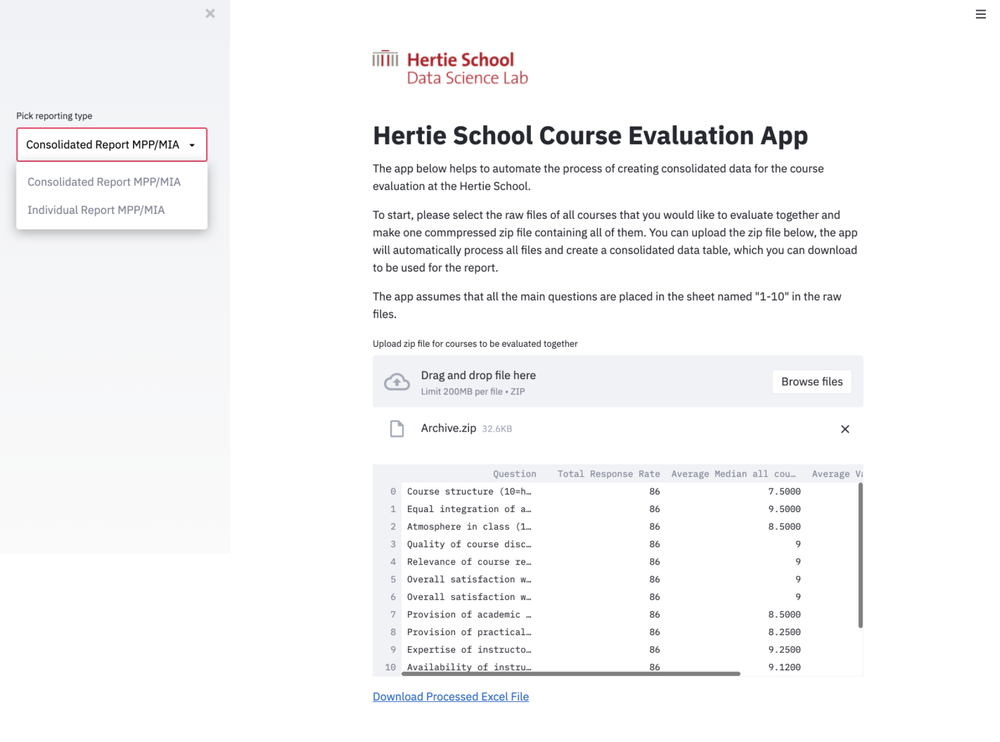

# Hertie School Course Evaluation Desktop App

This is an app to support Curricular Affairs team to automate part of their course evaluation procedure. There are Windows, Mac and Linux-compatible versions of the app available in the releases branch of this repo. 

Prototype for testing is available on Heroku at: https://hertie-course-eval.herokuapp.com/

However, all actuall reporting and data processing should be used through the Desktop app to guarantee data protection and privacy compliance. 

--- 

### For whoever that maintains this in the future, some notes: 

* MPP/MIA and EMPA courses are different in their question forms and should be processed differently; 
* Edge cases to keep track of: some courses have more than one instructors and their scores need to be averaged;
* Raw files are all in .xls format;
* Float formatting is wrong and needs to be converted from "," to "." for processing;
